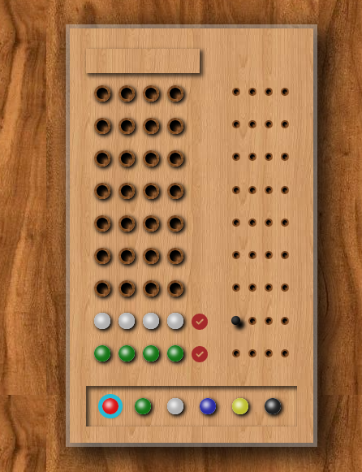

# 🎯 Mastermind Game

A colorful logic game built with React and TypeScript based on the classic **Mastermind** concept. The goal is to guess the correct combination of 4 unique colors within 9 attempts.

## 🧠 How to Play

- You have **9 chances** to guess a secret 4-color code.
- All colors are **unique**.
- After each guess, you'll receive feedback:
  - ⚫ **Black dot** = correct color & position
  - ⚪ **White dot** = correct color but wrong position

Use your logic and deduction skills to win!

## 🚀 Tech Stack

- ⚛️ **React**
- 💅 **Styled Components**
- ⛓ **Framer Motion**
- 🧩 **TypeScript**

## 📦 Project Structure


## 📸 Screenshot



## 🧪 Features

- 4-color secret code generation
- Result validation and feedback
- Win/Lose detection
- Play again functionality
- Fully responsive UI

Enjoy the game! 🕹️  

## 🚀 Getting Started

1. Clone the repository:
```bash
git clone https://github.com/ali-tz-2004/mastermind
cd chess

